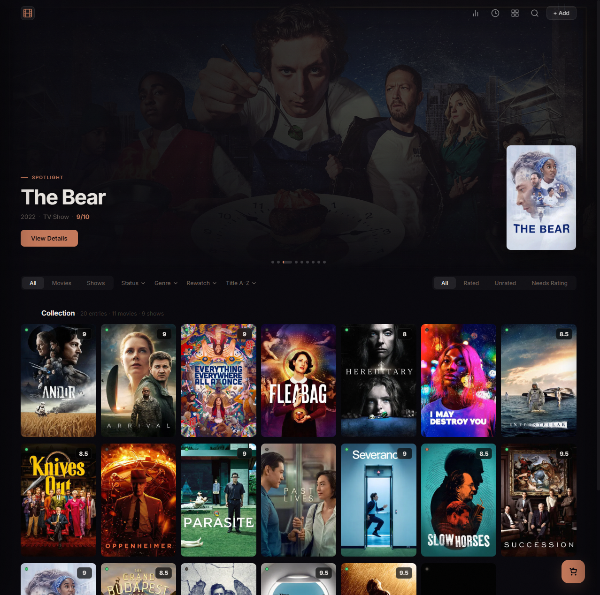
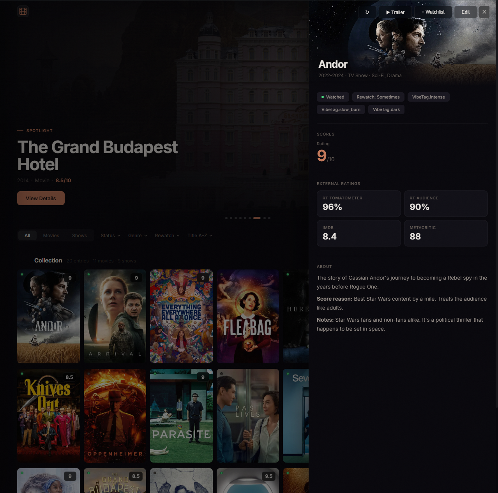
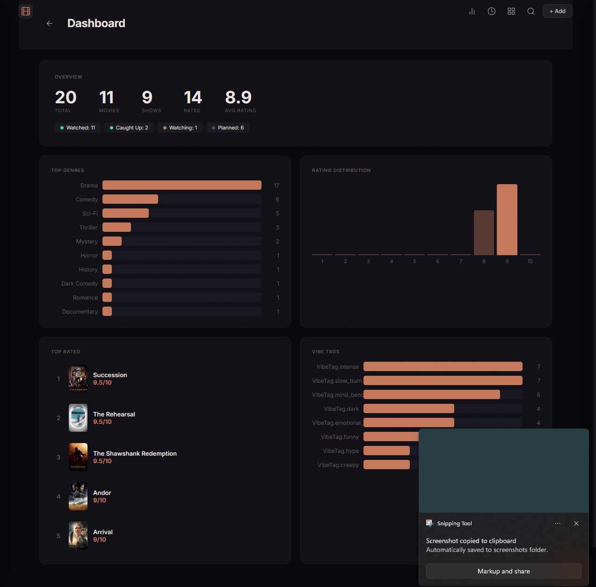

# Movie Catalog

A FastAPI + SQLite application for managing a personal movie and TV catalog. Built as a self-hosted alternative to spreadsheets and third-party trackers, with full control over ratings, notes, watchlists, and metadata.

Supports movie and show tracking, priority watchlists, custom lists, metadata enrichment from multiple sources, CSV import utilities, and AI-assisted watch recommendations powered by the Claude API.

---

## Features

- **Catalog management** — Add, edit, and delete movies and TV shows. Filter by type, watch status, and genre.
- **TMDB search** — Search and add titles by name with poster and metadata auto-populated from TMDB.
- **Metadata enrichment** — Pulls IMDb ratings, Rotten Tomatoes scores, Metacritic scores, and streaming availability from OMDb, MDBList, and Watchmode.
- **Ratings and notes** — Personal 1–10 score, rewatch tag, vibe tags, and three-part notes (what it's about, why you scored it, quick recommendation).
- **Watchlist** — Priority queue with drag-to-reorder. Top entry gets a featured card view. Entries auto-remove when marked watched.
- **Custom lists** — Create named lists with descriptions. Add any catalog entry; drag to reorder.
- **AI recommendations** — Three modes (Rewatch, Watch Next, Discover) with 40+ mood presets and freeform input. Uses Claude Haiku via tool use to return structured picks with explanations.
- **Convince Me** — Generates a short pitch for any backlog entry to help decide whether to watch it.
- **Dashboard** — Client-side stats: genre breakdown, rating histogram, top-rated titles, vibe tag cloud, and status summary.
- **CSV import** — Utility script to bulk-import an existing catalog from a CSV file.
- **Backfill scripts** — Standalone scripts to retroactively fetch IMDb data, posters, and Watchmode streaming info for existing entries.
- **Mobile-friendly** — Responsive layout with bottom-sheet dropdowns. Can be accessed from other devices on the same network.

---

## Screenshots



---



---



---

## Tech Stack

| Layer | Technology |
|---|---|
| Backend | Python 3.11+, FastAPI, Uvicorn |
| Database | SQLite, SQLAlchemy 2.x (sync ORM) |
| Frontend | Vanilla HTML, CSS, JavaScript; Jinja2 templates |
| AI | Anthropic Claude Haiku via `anthropic` SDK |
| Metadata | TMDB, OMDb, MDBList, Watchmode |
| Config | `python-dotenv` |

---

## Project Structure

```
movie-catalog/
├── app/
│   ├── main.py             # FastAPI app, lifespan, router mounts
│   ├── database.py         # SQLAlchemy engine, session factory, Base
│   ├── schemas.py          # Pydantic request/response models
│   ├── models/
│   │   └── catalog.py      # ORM models: Entry, Person, WatchlistItem, List
│   ├── routers/
│   │   ├── catalog.py      # CRUD, TMDB search, metadata enrichment, trailers
│   │   ├── watchlist.py    # Priority queue endpoints
│   │   ├── lists.py        # Custom list CRUD and reorder
│   │   └── recommend.py    # AI recommendations and Convince Me
│   └── services/
│       ├── claude.py       # Anthropic SDK — recommendations and convince
│       ├── tmdb.py         # TMDB search, poster backfill, trailers
│       ├── omdb.py         # OMDb API client
│       ├── mdblist.py      # MDBList fallback ratings
│       └── watchmode.py    # Streaming source lookup
├── scripts/
│   ├── import_csv.py       # Bulk-import catalog entries from CSV
│   ├── backfill_imdb.py    # Fetch missing IMDb data for existing entries
│   ├── backfill_posters.py # Fetch missing TMDB posters for existing entries
│   ├── backfill_watchmode.py # Fetch streaming sources for existing entries
│   └── migrate_scores.py   # One-time migration utility
├── static/
│   ├── css/style.css
│   └── js/app.js
├── templates/
│   └── index.html          # Single-page shell; JS handles client-side routing
├── .env.example
├── requirements.txt
└── CLAUDE.md
```

---

## Setup

**Requirements:** Python 3.11+

```bash
# Clone the repository
git clone https://github.com/ZoochyZ/movie-catalog-public.git
cd movie-catalog-public

# Create and activate a virtual environment
python -m venv venv
source venv/bin/activate       # macOS/Linux
venv\Scripts\activate          # Windows

# Install dependencies
pip install -r requirements.txt

# Configure environment variables
cp .env.example .env
# Edit .env and fill in your API keys
```

---

## Environment Variables

Copy `.env.example` to `.env` and provide values for each key.

```env
OMDB_API_KEY=        # https://www.omdbapi.com/apikey.aspx (free tier available)
MDBLIST_API_KEY=     # https://mdblist.com/api/ (free tier available)
ANTHROPIC_API_KEY=   # https://console.anthropic.com/ (required for recommendations)
DATABASE_URL=sqlite:///./catalog.db
```

TMDB and Watchmode API keys are also used by the enrichment services. Add them to your `.env` if you want poster search, trailer lookup, and streaming availability.

The application will start without all keys populated, but enrichment features and AI recommendations will be disabled for any missing service.

---

## Running Locally

```bash
# Local access only
uvicorn app.main:app --reload

# Accessible from other devices on the same network (e.g., phone)
uvicorn app.main:app --reload --host 0.0.0.0
```

The app runs at `http://localhost:8000`. The database is created automatically on first launch.

---

## Data and Privacy

The following are excluded from this repository:

- `.env` — contains personal API keys
- `catalog.db` — local SQLite database with personal catalog data
- Any personal CSV files used for import

To use this app, create your own `.env` from `.env.example` and populate it with your own API keys. Your catalog data stays local.

---

## Possible Future Improvements

- User authentication for multi-user or network-accessible deployments
- Export catalog to CSV or JSON
- Season-level tracking for TV shows
- Trailer playback embedded in the catalog view
- Bulk enrichment progress UI
